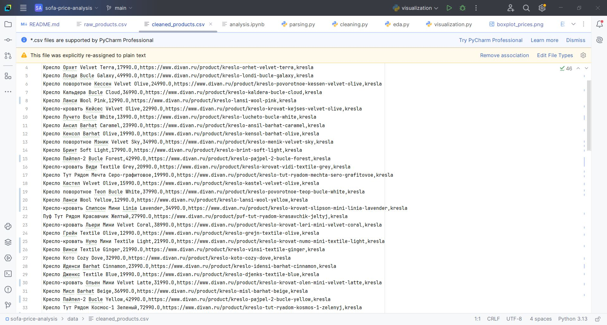
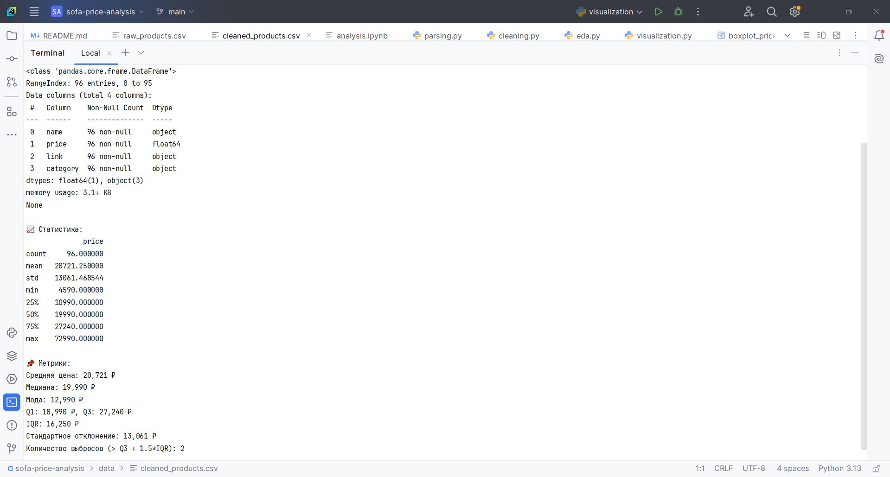
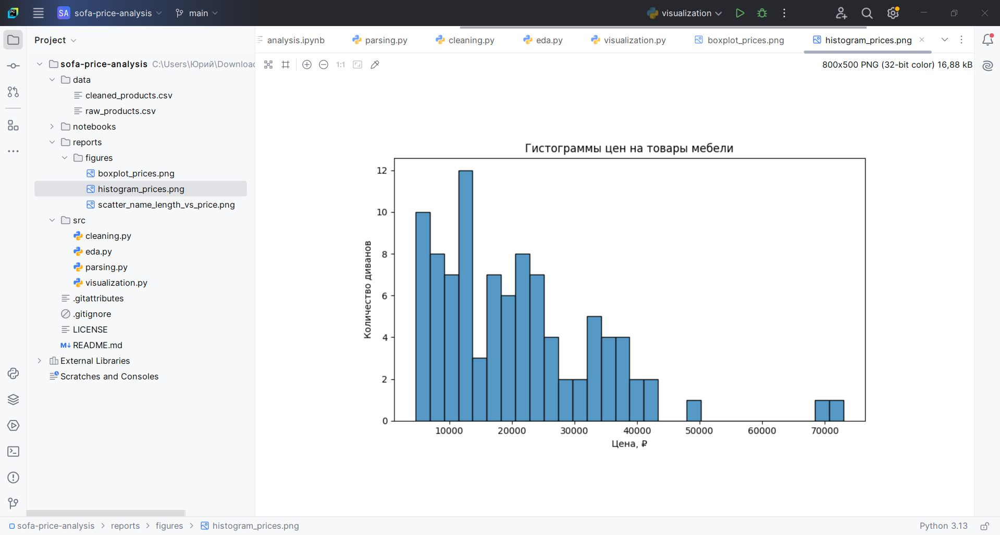

# Анализ цен на мебель с сайта divan.ru

**Описание**

Учебный проект на Python, который охватывает полный цикл работы с данными: от парсинга товаров с сайта 
[divan.ru] до удаления пустых значений и некорректных ценовых строк, анализа и визуализации.
В отличие от проекта по «чистому парсингу», здесь основной фокус сделан на аналитике и интерпретации данных.

---

## Основные возможности

**Парсинг данных с сайта divan.ru:**
  * Сбор названия, цены и ссылки на товары
  * Поддержка нескольких категорий (диваны, кресла, пуфы)

**Очистка данных** (cleaning.py):
  * Приведение цен к числовому виду
  * Удаление пустых или некорректных строк 

**Базовая статистика** (eda.py):
  * df.info(), df.describe()
  * Среднее, медиана, мода
  * Квартиль 1 (Q1), квартиль 3 (Q3), межквартильный размах (IQR), стандартное отклонение
  * Подсчёт количества выбросов

**Визуализация** (visualization.py + analysis.ipynb):
  * 📊 Гистограмма цен
  * 📦 Boxplot (выбросы)
  * 🔵 KDE-график распределения цен
  * 🔎 Scatterplot: цена vs длина названия товара

**Интерпретация графиков** (analysis.ipynb):
  * Распределение асимметрично, среднее выше медианы → перекос в сторону дорогих предметов мебели
  * Гистограмма и KDE: основная масса мебели сосредоточена в диапазоне до ~30 000 ₽, а дальше кривая постепенно спадает.
  * Boxplot показывает наличие выбросов → премиум-модели сильно отличаются от основной массы
  * Scatterplot: длина названия не гарантирует высокую цену, хотя иногда маркетологи стараются оправдать цену количеством букв

---

## Архитектура проекта

* **Парсер** — Selenium (Python 3.13).

* **Обработка данных** — Pandas и NumPy: удаления пустых значений и некорректных ценовых строк, преобразование типов, базовый EDA.

* **Визуализация** — Matplotlib и Seaborn: построение графиков для анализа цен.

* **Логирование** — встроенный logging для отслеживания работы скриптов.

---

## Установка и запуск

1. **Клонировать репозиторий**:

   ```bash
   git clone https://github.com/ваш_пользователь/sofa-price-analysis.git
   cd sofa-price-analysis
   ```
   
2. **Создать виртуальное окружение и установить зависимости**:

   ```bash
    python3 -m venv venv
    source venv/bin/activate  # Linux/macOS
    venv\Scripts\activate     # Windows
    pip install -r requirements.txt
   ```
   
3. **Запуск по шагам:**

   * Парсинг (сбор данных):

   ```bash
   python src/parsing.py
   ```

   * Очистка:

   ```bash
   python src/cleaning.py
   ```

   * Базовая статистика:

   ```bash
   python src/eda.py
   ```

   * Визуализация:

   ```bash
   python -m src.visualization
   ```
   
---

## Пример графиков

* 📊 Гистограмма цен
* 📦 Boxplot
* 🔵 KDE-график
* 🔎 Scatterplot: цена vs длина названия

---

## Зависимости

Основные библиотеки:
* selenium — парсинг данных
* pandas, numpy — обработка данных
* matplotlib, seaborn — визуализация

Полный список зависимостей в requirements.txt.

---

## Структура проекта

```
sofa-price-analysis/
├── data/                     
│   ├── raw_products.csv                         # сохранение парсинга данных
│   └── cleaned_products.csv                     # сохранение очищенных данных
├── notebooks/
│   └── analysis.ipynb                           # интерпретация графиков
├── src/
│   ├── parsing.py                               # парсинг данных
│   ├── cleaning.py                              # очистка данных
│   ├── eda.py                                   # базовая статистика
│   └── visualization.py                         # визуализация графиков
├── reports
│   └── figures
│       ├── boxplot_prices.png                   # boxplot
│       ├── kde_prices.png                       # KDE
│       ├── histogram_prices.png                 # гистограмма цен
│       └── scatter_name_length_vs_price.png     # scatterplot
├── screenshots/                                 # скриншоты графиков
├── requirements.txt                             # зависимости
└── README.md                                    # документация
```

---

## План разработки

Проект рассчитан на 4 дня:

1. Этап 1 (День 1): настройка окружения, создание архитектуры проекта (parser.py, exporters/, data/, src/). 
    Подготовка requirements.txt и README.md.
    Реализация парсинга категорий мебели (sofas, kresla, pufy) и сохранение в raw_products.csv.

2. Этап 2 (День 2): очистка данных и базовая статистика:
    - cleaning.py - очистка цен (удаление ₽, пробелов, мусорных строк) и сохранение в cleaned_products.csv.  
    - eda.py - базовый EDA (df.info(), df.describe()), расчёт ключевых метрик (среднее, медиана, мода, IQR, выбросы).  

3. Этап 3 (День 3): визуализация и аналитика:  
    - visualization.py: построение графиков (гистограмма, boxplot, KDE, scatterplot «цена vs длина названия»).  
    - analysis.ipynb: интерпретация графиков, описание распределений, выводы по выбросам и структуре данных.  

4. Этап 4 (День 4): финализация проекта:
    - оформление README.md (архитектура проекта, примеры графиков, ограничения, инструкции).

---

## Лицензия

Проект распространяется под MIT License.

---

## Скриншоты

**Пример данных парсинга после очистки**


**Пример вывода EDA.py в консоли**


**Пример гистограммы цен на товары мебели**

